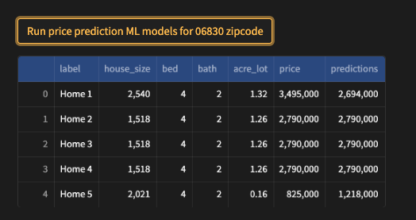

# Real-estate-price-predictor

Real estate price predictor using Machine Learning models - U.S. Mainland, Puerto Rico & U.S. Virgin Islands

## Demo Preview

**Project flowchart**

  

**UI flow - screenshot 01**

  

**UI flow - screenshot 02**

  

**UI flow - screenshot 03**

## Table of contents

- [Objective](#objective)
- [Demo-Preview](#demo-preview)
- [Environment setup](#environment-setup)
- [Technologies](#technologies)
- [Deployment](#deployment)
- [Contributors](#contributors)
- [Next steps](#next-steps)
- [License](#license)

## Objective
[(Back to top)](#table-of-contents)

The objective of this project is to predict the selling prices of houses for a real estate app. Static historical data was gathere from Kaggle, on past house sales, including the number of bedrooms, bathrooms, lot acre, house size and state or region in United States, along with the final selling price. 
The purpose is to implement and deploy machine learning model(s) that can accurately predict the selling price of a house based on its features. Additionally, by using multiple machine learning models, the app evaluates the ML performance against scoring metrics, to provide the user the best ML option. 
This project aims to help the company make informed decisions based on accurate predictions and improve their business outcomes.

## Environment setup
[(Back to top)](#table-of-contents)

- `conda create -n [name] python=3.9`
- `conda activate [name]`
- `git init`
- `git clone` repo
- `pip install -r requirements.txt`

## Technologies
[(Back to top)](#table-of-contents)

`python`, `anaconda`, `numpy`, `matplotlib`, `pandas`, `streamlit`, `sklearn`

## Deployment
[(Back to top)](#table-of-contents)

- In Terminal `cd` into cloned repo
- `cd` to `src` directory where `home.py` file is located
- `streamlit run home.py`
- The app will run on `http://localhost:8501/`

## Contributors
[(Back to top)](#table-of-contents)

[Christine Pham](https://github.com/cpham35?tab=repositories) - `cpham35`

[Kranthi C Mitta](https://github.com/kranthicmitta?tab=repositories) - `kranthicmitta` 

[Ayush Jha](https://github.com/jha-ayush?tab=repositories) - `jha-ayush`

## Next steps
[(Back to top)](#table-of-contents)

- Initial data capture - better, more robust data sets, time series data, paid APIs
- Include attributes like `price_per_sq_ft`, `address`, `date_sold`, etc.
- Use conformal prediction to find the best ranked sore for price predictions
- Blockchain implementation: By recording real estate data on a blockchain, we can create a transparent and immutable record of real estate transactions. This can help prevent fraud and corruption, as all transactions are publicly visible and cannot be altered after the fact.
- Rental predictions based on bed, batha nd square footage
- Realestate portfolio creation and management for investors
- House price prediction based on sq footage price using time series data

## License
[(Back to top)](#table-of-contents)

**MIT License**

Copyright ©  [2023]

Permission is hereby granted, free of charge, to any person obtaining a copy
of this software and associated documentation files (the "Software"), to deal
in the Software without restriction, including without limitation the rights
to use, copy, modify, merge, publish, distribute, sublicense, and/or sell
copies of the Software, and to permit persons to whom the Software is
furnished to do so, subject to the following conditions:

The above copyright notice and this permission notice shall be included in all
copies or substantial portions of the Software.

THE SOFTWARE IS PROVIDED "AS IS", WITHOUT WARRANTY OF ANY KIND, EXPRESS OR
IMPLIED, INCLUDING BUT NOT LIMITED TO THE WARRANTIES OF MERCHANTABILITY,
FITNESS FOR A PARTICULAR PURPOSE AND NONINFRINGEMENT. IN NO EVENT SHALL THE
AUTHORS OR COPYRIGHT HOLDERS BE LIABLE FOR ANY CLAIM, DAMAGES OR OTHER
LIABILITY, WHETHER IN AN ACTION OF CONTRACT, TORT OR OTHERWISE, ARISING FROM,
OUT OF OR IN CONNECTION WITH THE SOFTWARE OR THE USE OR OTHER DEALINGS IN THE
SOFTWARE.

**Note:** This app is for educational purposes only.